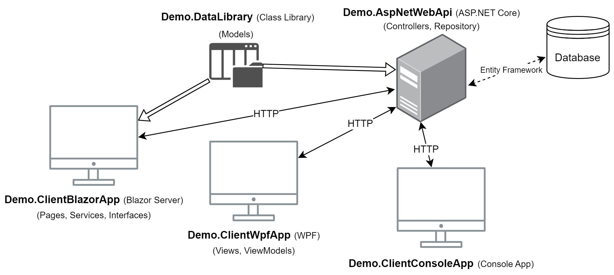
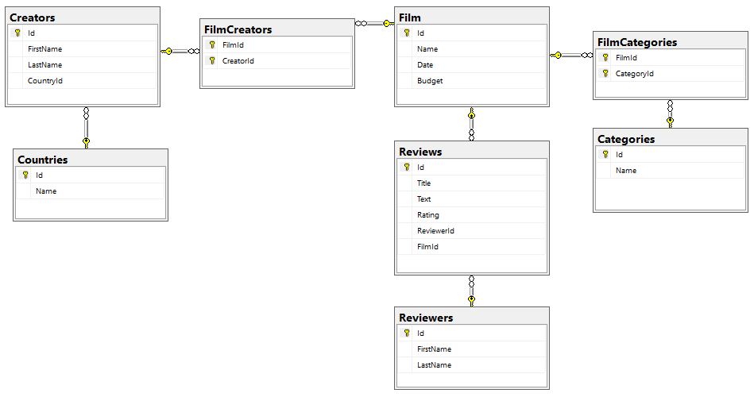
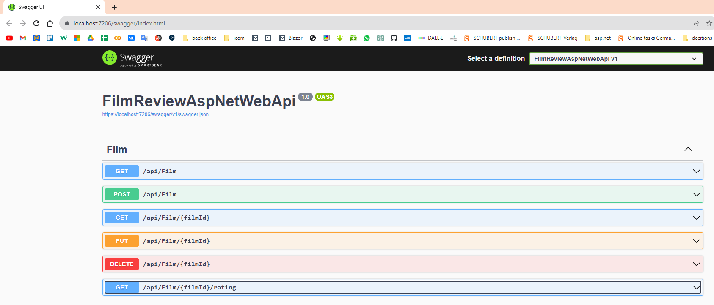
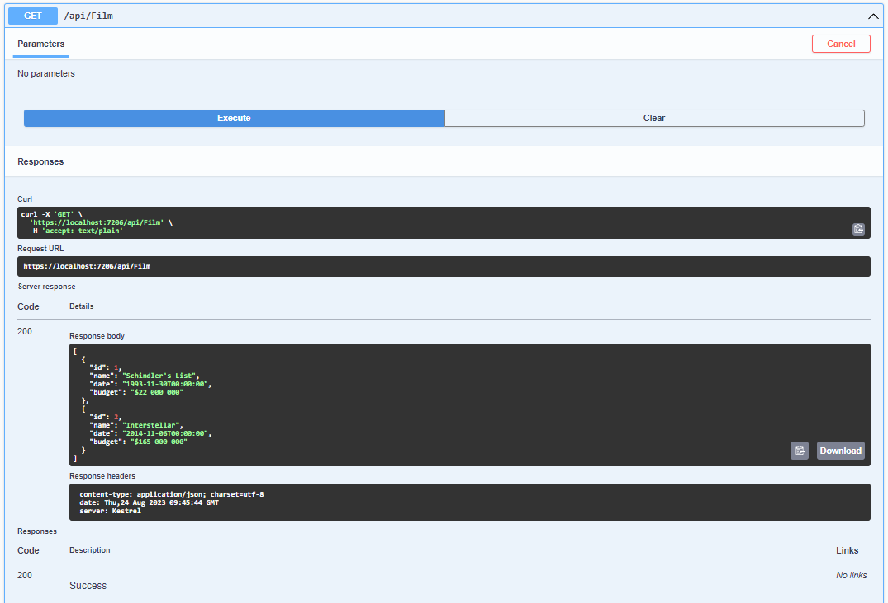
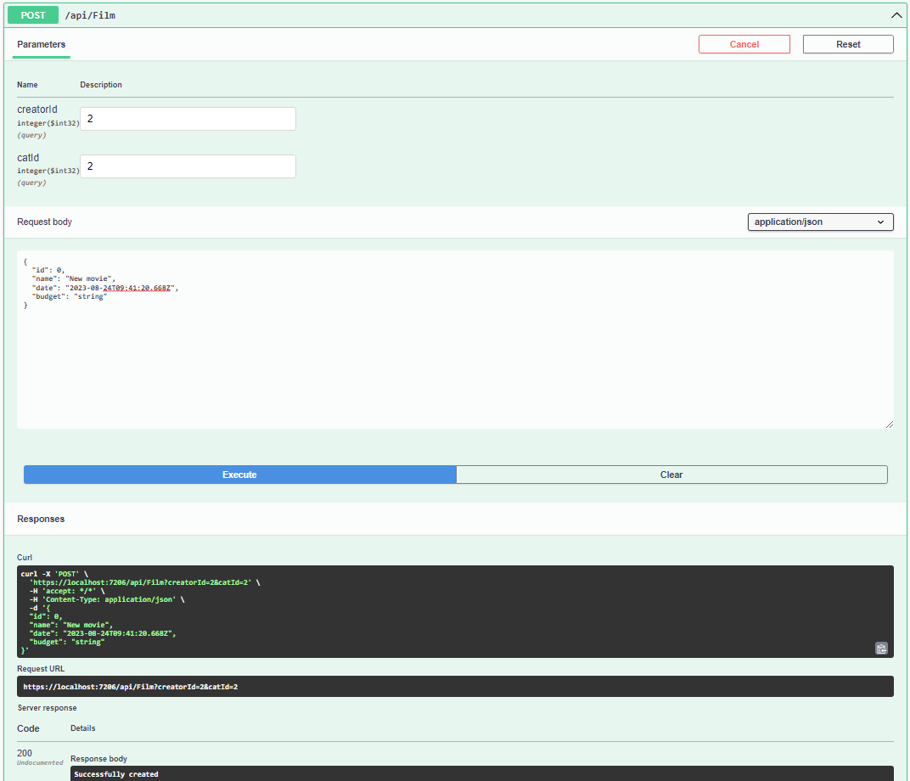
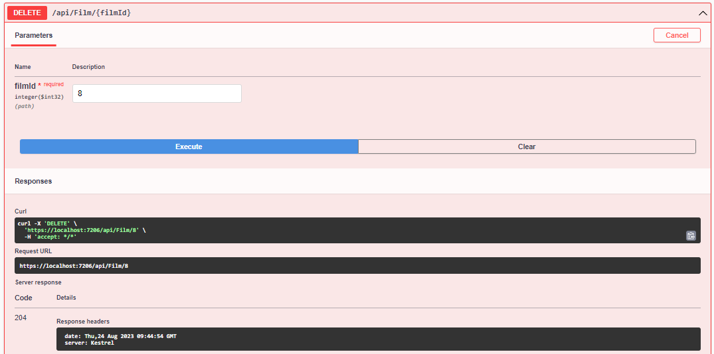

**Key technologies:** *ASP.NET Core Web API, NET 7, C#, Microsoft SQL Server, Entity Framework, CRUD, HttpClient, Console App, WPF, Blazoe Server, Class Library*

## Information
CRUD operations in API. Server(API) and client (Concole App, WPF and Blazor Server) connection using HttpClient.

## Server(API) and client (Concole App and WPF) connection using HttpClient.
### Server, WPF, Concole App
1 - Server API ASP.NET, 2- Blazor Server, 3 - Console App, 4 - WPF

### The structure of Server, WPF, Concole App

## CRUD operations in API
### The structure of API
.png)

### The structure of DataBase

### Swagger (as Postman)

### Get

### Post

### Put

### Delete

